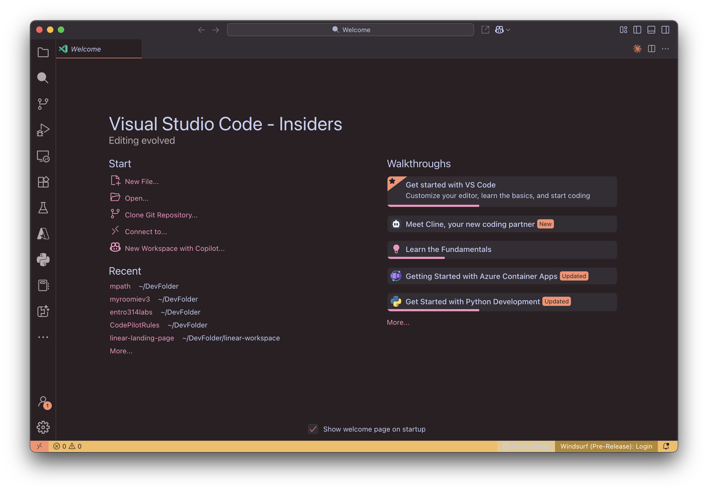

# Warm Sunset Theme for VS Code

A beautiful VS Code theme with warm and cozy colors for both light and dark environments. This theme provides a pleasant and comfortable coding experience with good contrast for readability.

## 🌅 Preview

*Screenshots will be added after the first release.*

<!--
Once you've published your theme, you can add screenshots here:

### Light Theme


### Dark Theme

-->

## ✨ Features

- Two carefully crafted themes: Light and Dark
- Warm, cozy colors that are easy on the eyes
- Good contrast for readability
- Consistent color palette across all elements
- Detailed syntax highlighting for various languages

## 🎨 Color Palette

### Light Theme
- **Background**: #FAF4F2 - A soft, warm off-white background
- **Foreground**: #384242 - A dark muted teal for text
- **Primary**: #FA906E - A warm coral accent color
- **Secondary**: #FDE6DE - A very soft coral for backgrounds
- **Accent**: #F5BC5E - A warm amber for highlights and warnings
- **Muted**: #F5F1EB - A soft beige for inactive elements
- **Success**: #A6D18C - A soft green for success indicators
- **Warning**: #F4BC5F - An amber tone for warnings
- **Error**: #E06053 - A soft red for errors

### Dark Theme
- **Background**: #2A2023 - A deep, warm dark plum background
- **Foreground**: #C6D0F5 - A soft blue-lavender for text
- **Primary**: #FA906E - A warm coral accent color
- **Secondary**: #403A40 - A muted plum for backgrounds
- **Accent**: #F5BC5E - A warm amber for highlights
- **Muted**: #342D34 - A deep muted plum for inactive elements
- **Success**: #A6D18C - A soft green for success indicators
- **Warning**: #E5C890 - A soft gold for warnings
- **Error**: #E78284 - A soft red for errors

## 📥 Installation

1. Open **Extensions** sidebar in VS Code
2. Search for `Warm Sunset Theme`
3. Click **Install**
4. Click **Reload** to reload VS Code
5. From the menu bar click: Code > Preferences > Color Theme > **Warm Sunset Light** or **Warm Sunset Dark**

## 🚀 Manual Installation

If you prefer to install manually:

1. Download the latest release from the [GitHub repository](https://github.com/idominikosgr/warm-sunset-vscode-theme)
2. Unzip the downloaded file
3. Copy the folder to your VS Code extensions directory:
   - **Windows**: `%USERPROFILE%\.vscode\extensions`
   - **macOS/Linux**: `~/.vscode/extensions`
4. Restart VS Code
5. From the menu bar click: Code > Preferences > Color Theme > **Warm Sunset Light** or **Warm Sunset Dark**

## 🔧 Customization

If you want to customize this theme further:

1. Open your VS Code settings.json by pressing `Ctrl+Shift+P` (Windows/Linux) or `Cmd+Shift+P` (macOS)
2. Type "settings" and select "Preferences: Open Settings (JSON)"
3. Add your overrides within the `"editor.tokenColorCustomizations"` section

Example:

```json
"editor.tokenColorCustomizations": {
    "[Warm Sunset - Light]": {
        "comments": "#95726A"
    },
    "[Warm Sunset - Dark]": {
        "comments": "#B5A9AF"
    }
}
```

## 🤝 Contributing

Contributions are welcome! Feel free to:

1. [Fork the repository](https://github.com/idominikosgr/warm-sunset-vscode-theme/fork)
2. Create your feature branch: `git checkout -b my-new-feature`
3. Commit your changes: `git commit -am 'Add some feature'`
4. Push to the branch: `git push origin my-new-feature`
5. Submit a pull request

## 📄 License

This theme is licensed under the [MIT License](LICENSE)

## 👏 Credits

- Created with ❤️ by idominikosgr
- Inspired by the warm colors of a sunset