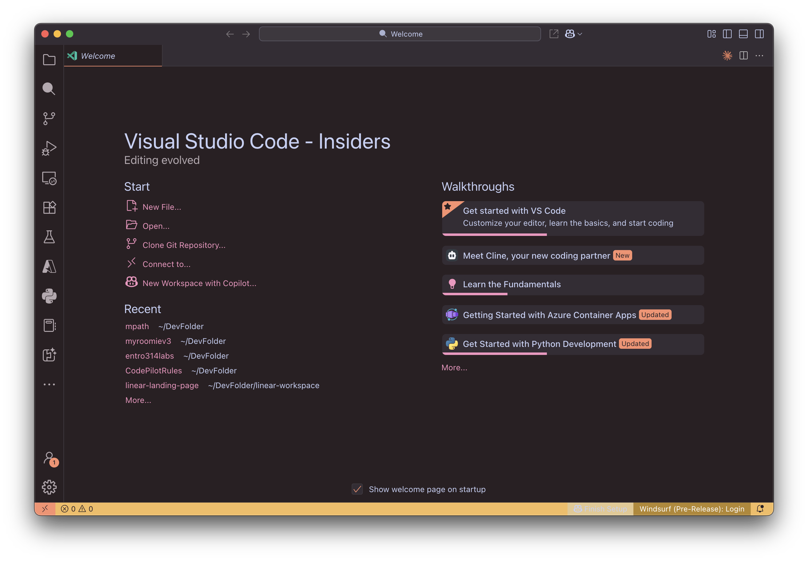

<div align="center">

# 🌅 Warm Sunset Theme

*A beautiful VS Code theme that brings the magic of golden hour to your coding experience*

[](https://marketplace.visualstudio.com/items?itemName=idominikosgr.warm-sunset-theme)
[](https://github.com/idominikosgr/warm-sunset-vscode-theme)
[](LICENSE)

**Transform your coding environment with warm, cozy colors that reduce eye strain and create a delightful development experience.**

*Perfect for developers who love working during golden hour, even when the sun has set* 🌇

</div>

---

## 🌅 Preview

*Screenshots will be added after the first release.*

<!--
Once you've published your theme, you can add screenshots here:

### Light Theme


### Dark Theme

-->

## 🎯 **Why Choose Warm Sunset?**

<table>
<tr>
<td>🔥</td>
<td><strong>Dual Themes</strong><br/>Beautiful light and dark variants for any time of day</td>
</tr>
<tr>
<td>👁️</td>
<td><strong>Eye-Friendly</strong><br/>Carefully selected warm colors that reduce eye strain</td>
</tr>
<tr>
<td>🎨</td>
<td><strong>Thoughtful Design</strong><br/>Every color has been chosen to create harmony and focus</td>
</tr>
<tr>
<td>⚡</td>
<td><strong>Enhanced Productivity</strong><br/>Clear syntax highlighting improves code readability</td>
</tr>
<tr>
<td>🌍</td>
<td><strong>Universal Support</strong><br/>Works beautifully with all major programming languages</td>
</tr>
</table>

## 🎨 **Color Palette**

> *Each color tells a story of warmth and tranquility*

<div align="center">

### ☀️ Light Theme - *Morning Glow*
<table>
<tr>
<td align="center" style="background-color: #FAF4F2; color: #384242; padding: 10px;">
<strong>Background</strong><br/>
<code>#FAF4F2</code><br/>
<em>Soft morning light</em>
</td>
<td align="center" style="background-color: #FA906E; color: white; padding: 10px;">
<strong>Primary</strong><br/>
<code>#FA906E</code><br/>
<em>Warm coral sunset</em>
</td>
<td align="center" style="background-color: #F5BC5E; color: #384242; padding: 10px;">
<strong>Accent</strong><br/>
<code>#F5BC5E</code><br/>
<em>Golden hour amber</em>
</td>
</tr>
</table>

### 🌙 Dark Theme - *Evening Embrace*
<table>
<tr>
<td align="center" style="background-color: #2A2023; color: #C6D0F5; padding: 10px;">
<strong>Background</strong><br/>
<code>#2A2023</code><br/>
<em>Deep twilight plum</em>
</td>
<td align="center" style="background-color: #FA906E; color: white; padding: 10px;">
<strong>Primary</strong><br/>
<code>#FA906E</code><br/>
<em>Warm coral glow</em>
</td>
<td align="center" style="background-color: #F5BC5E; color: #2A2023; padding: 10px;">
<strong>Accent</strong><br/>
<code>#F5BC5E</code><br/>
<em>Moonlit amber</em>
</td>
</tr>
</table>

</div>

<details>
<summary>🔍 <strong>View Complete Color Specifications</strong></summary>

### Light Theme Palette
- **Background**: `#FAF4F2` - A soft, warm off-white background
- **Foreground**: `#384242` - A dark muted teal for text
- **Primary**: `#FA906E` - A warm coral accent color
- **Secondary**: `#FDE6DE` - A very soft coral for backgrounds
- **Accent**: `#F5BC5E` - A warm amber for highlights and warnings
- **Muted**: `#F5F1EB` - A soft beige for inactive elements
- **Success**: `#A6D18C` - A soft green for success indicators
- **Warning**: `#F4BC5F` - An amber tone for warnings
- **Error**: `#E06053` - A soft red for errors

### Dark Theme Palette
- **Background**: `#2A2023` - A deep, warm dark plum background
- **Foreground**: `#C6D0F5` - A soft blue-lavender for text
- **Primary**: `#FA906E` - A warm coral accent color
- **Secondary**: `#403A40` - A muted plum for backgrounds
- **Accent**: `#F5BC5E` - A warm amber for highlights
- **Muted**: `#342D34` - A deep muted plum for inactive elements
- **Success**: `#A6D18C` - A soft green for success indicators
- **Warning**: `#E5C890` - A soft gold for warnings
- **Error**: `#E78284` - A soft red for errors

</details>

## � **Quick Start**

### Installation from VS Code Marketplace
```bash
# Method 1: Through VS Code
1. Open Extensions (Ctrl+Shift+X / Cmd+Shift+X)
2. Search "Warm Sunset Theme"
3. Click Install → Select theme variant
```

### Alternative Installation Methods

<details>
<summary>� <strong>Manual Installation</strong></summary>

1. Download the latest [release](https://github.com/idominikosgr/warm-sunset-vscode-theme/releases)
2. Extract to your VS Code extensions directory:
   - **Windows**: `%USERPROFILE%\.vscode\extensions`
   - **macOS/Linux**: `~/.vscode/extensions`
3. Restart VS Code and select your preferred theme

</details>

<details>
<summary>⚡ <strong>Command Line Installation</strong></summary>

```bash
# Install via VS Code CLI
code --install-extension idominikosgr.warm-sunset-theme
```

</details>

### 🎛️ **Activation**
1. `Ctrl+Shift+P` / `Cmd+Shift+P` → **Preferences: Color Theme**
2. Choose **Warm Sunset - Light** or **Warm Sunset - Dark**
3. Enjoy your beautiful new coding environment! ✨

## 🎨 **Make It Yours**

Want to add your personal touch? Here's how to customize:

<details>
<summary>🛠️ <strong>Theme Customization Guide</strong></summary>

1. Open **Settings** → **Open Settings (JSON)** (`Ctrl+Shift+P` / `Cmd+Shift+P`)
2. Add your customizations:

```json
{
  "editor.tokenColorCustomizations": {
    "[Warm Sunset - Light]": {
      "comments": "#95726A",
      "strings": "#8B6F47"
    },
    "[Warm Sunset - Dark]": {
      "comments": "#B5A9AF",
      "strings": "#D4B896"
    }
  },
  "workbench.colorCustomizations": {
    "[Warm Sunset - Light]": {
      "activityBar.background": "#F9E8E2"
    },
    "[Warm Sunset - Dark]": {
      "activityBar.background": "#1F1A1D"
    }
  }
}
```

</details>

---

## 🤝 **Join the Community**

Love the theme? Here's how you can contribute:

<div align="center">

| 🐛 **Found a bug?** | 💡 **Have an idea?** | ⭐ **Love it?** |
|:---:|:---:|:---:|
| [Report Issue](https://github.com/idominikosgr/warm-sunset-vscode-theme/issues) | [Request Feature](https://github.com/idominikosgr/warm-sunset-vscode-theme/issues) | [Star Repository](https://github.com/idominikosgr/warm-sunset-vscode-theme) |

</div>

### 🔧 Contributing Steps
1. 🍴 [Fork the repository](https://github.com/idominikosgr/warm-sunset-vscode-theme/fork)
2. 🌿 Create your feature branch: `git checkout -b amazing-feature`
3. 💫 Commit your changes: `git commit -m 'Add amazing feature'`
4. 🚀 Push to the branch: `git push origin amazing-feature`
5. 🎯 Open a Pull Request

---

<div align="center">

## � **License & Credits**

**📄 License:** [MIT License](LICENSE) - Free to use, modify, and distribute!

**👨‍💻 Created with ❤️ by [Dominikos Pritis](https://github.com/idominikosgr)**

*Inspired by the magical colors that paint the sky during golden hour* 🌅

---

### 🌟 **Show Your Support**

If this theme makes your coding experience better, please consider:
- ⭐ Starring the repository
- 🐦 Sharing with fellow developers
- ☕ [Buy me a coffee](https://ko-fi.com/dominikos) *(optional)*

**Happy coding in warm, beautiful colors!** ✨

</div>